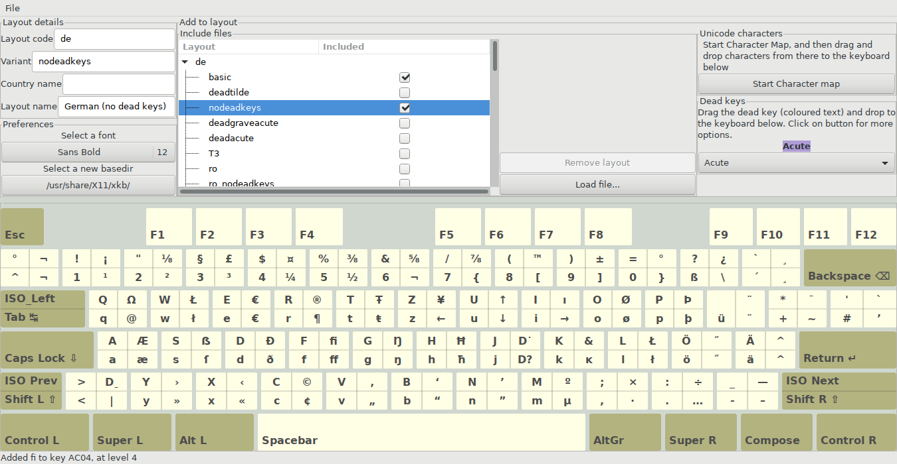

# Keyboard Layout Editor

PyGTK program that helps create or edit XKB keyboard layouts. Created by [@simos](https://github.com/simos) in Google Summer of Code 2008. [More information](http://simos.info/blog/archives/747/)



## Changes to upstream

This is not the upstream source. It's a fork to fix some bugs that are not
incorporated into upstream yet. If you are searching for the non-patched
upstream see http://github.com/simos/keyboardlayouteditor.

The following bugs are fixed in this fork:

 - [Don't throw an exception on a `replace` directive](http://github.com/simos/keyboardlayouteditor/issues/24)
 - [Respect selected font style](http://github.com/simos/keyboardlayouteditor/issues/25)
 - [Fixed inverted right/left-tacks & up-/down-tacks (thanks to gnu9)](https://github.com/simos/keyboardlayouteditor/pull/14)
 - [Update README to newer antlr (thanks to blurayne)](https://github.com/simos/keyboardlayouteditor/pull/31)

Additional changes:

 - Print symbol next to special keys names (for Backspace ⌫, Caps Lock ⇩, Return ↵, Shift ⇧, Tab ↹)

This version incorporates various changes/fixes from:

- https://github.com/154pinkchairs/keyboardlayouteditor
- https://github.com/hupfdule/keyboardlayouteditor
- https://github.com/rrika/keyboardlayouteditor
- https://github.com/phrxmd/keyboardlayouteditor


## Requirements

To run the application, you need the python UI binding packages.

* python-gtk2 => 2.24.0
* python-gobject => 0.1.0
* python-lxml => 4.8.0
* python-enum => 0.4.7

For Ubuntu 14.04, the packages below are already pre-installed.

* Cairo
* Pango
* GObject
* lxml

For later versions of Ubuntu, the lxml package does not come preinstalled. If you get error messages, install it manually:

```
$ sudo apt-get install python-lxml
```

## Installation

Clone the repository with

```
$ git clone https://github.com/Drugwash2/Keyboard-Layout-Editor.git
```

You need to process the ANTLR grammars in order to generate the necessary Python code.
This is a process that you do one time only (unless you make changes in the grammar files).

All *.g files should be processed with ANTLR:

```
    $ cd keyboardlayouteditor/
    $ sudo apt-get install python-pip
    $ sudo pip install http://www.antlr3.org/download/Python/antlr_python_runtime-3.1.2.tar.gz
    $ wget http://www.antlr3.org/download/antlr-3.1.2.jar
    $ java -classpath antlr-3.1.2.jar org.antlr.Tool *.g
```

The first command installs the Python 2 package manager.

The second command installs the Python 2 Antlr 3.1.2 runtime.

The third command downloads the antlr 3.1.2 JAR file (code of Antlr) in the current directory.

The antlr3 package in Ubuntu is for Antlr 3.2, but we cannot use it because it is a bit complicated to get a 3.2 python runtime.

The fourth command runs the Antlr code on the .g grammar files that exist in the KeyboardLayoutEditor directory.

These are four files, and produces the processed grammar.

Then, you can start the KeyboardLayoutEditor program.


## Running

You finally run this program with:

```
$ ./KeyboardLayoutEditor
```
